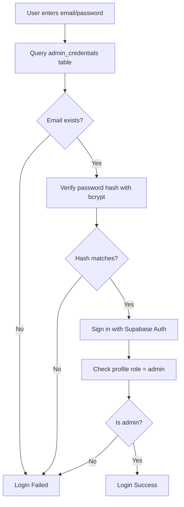

# Admin Credentials Setup (Database-Based)

## ✅ Secure Approach Using Database Table

Instead of hardcoding credentials in JavaScript, they're stored securely in a Supabase table with hashed passwords.

---

## Step 1: Generate Password Hash

You need to generate a bcrypt hash for your password. Use one of these methods:

### Option A: Online Tool (Quick)
1. Go to https://bcrypt-generator.com/
2. Enter your password: `GKK@Admin2026`
3. Set rounds to: `10`
4. Click "Generate"
5. Copy the hash (looks like `$2a$10$abc123...`)

### Option B: Node.js Script (Recommended)
```javascript
// hash-password.js
const bcrypt = require('bcryptjs');
const password = 'GKK@Admin2026';
const hash = bcrypt.hashSync(password, 10);
console.log('Hash:', hash);
```

Run:
```bash
npm install bcryptjs
node hash-password.js
```

### Option C: Browser Console
Open browser console and paste:
```javascript
// Load bcrypt from CDN first
const script = document.createElement('script');
script.src = 'https://cdn.jsdelivr.net/npm/bcryptjs@2.4.3/dist/bcrypt.min.js';
script.onload = () => {
    const hash = bcrypt.hashSync('GKK@Admin2026', 10);
    console.log('Hash:', hash);
};
document.head.appendChild(script);
```

---

## Step 2: Run Database Schema

1. Open [Supabase SQL Editor](https://supabase.com/dashboard/project/hjpsyxqakzrhvzegehtm/sql/new)
2. Copy the contents of `Database/admin_credentials_schema.sql`
3. **Replace the placeholder hash** with your generated hash:

```sql
INSERT INTO admin_credentials (email, password_hash, is_active) 
VALUES (
    'admin@gkk-hire.com',
    'YOUR_GENERATED_HASH_HERE',  -- Replace this
    true
);
```

4. Click **Run**

---

## Step 3: Create Admin Supabase Account

You still need an actual Supabase auth user:

1. Go to [Authentication → Users](https://supabase.com/dashboard/project/hjpsyxqakzrhvzegehtm/auth/users)
2. Click **Add user** → **Create new user**
3. Enter:
   - **Email:** `admin@gkk-hire.com`
   - **Password:** `GKK@Admin2026`
   - **Auto Confirm User:** ✅
4. Click **Create user**

---

## Step 4: Set Admin Role

Run this SQL to make the user an admin:

```sql
-- Update the profile role
UPDATE profiles 
SET role = 'admin', status = 'active'
WHERE email = 'admin@gkk-hire.com';

-- If profile doesn't exist, create it
INSERT INTO profiles (id, email, full_name, role, status)
SELECT 
    id, 
    email, 
    'Admin', 
    'admin', 
    'active'
FROM auth.users 
WHERE email = 'admin@gkk-hire.com'
ON CONFLICT (id) DO UPDATE SET role = 'admin';
```

---

## How It Works (Security Flow)



**4-Layer Security:**
1. ✅ Email must exist in `admin_credentials` table
2. ✅ Password hash must match (bcrypt verification)
3. ✅ Supabase auth account must exist
4. ✅ Profile role must be 'admin'

---

## Why This is More Secure

| Feature | Hardcoded | Database Table |
|---------|-----------|----------------|
| **Credentials visible in page source?** | ❌ Yes | ✅ No |
| **Password stored as plain text?** | ❌ Yes | ✅ No (hashed) |
| **Can be changed without redeploying?** | ❌ No | ✅ Yes |
| **Can add multiple admins?** | ❌ No | ✅ Yes |
| **Rate limiting possible?** | ❌ Hard | ✅ Easy |

---

## Adding More Admins

Just insert another row:

```sql
-- First, generate hash for the new password
-- Then insert:
INSERT INTO admin_credentials (email, password_hash, is_active) 
VALUES (
    'another-admin@gkk-hire.com',
    '$2a$10$NEW_HASH_HERE',
    true
);
```

And create the Supabase user + profile as shown in Steps 3-4.

---

## Changing Admin Password

```sql
-- Generate new hash first, then:
UPDATE admin_credentials 
SET password_hash = '$2a$10$NEW_HASH_HERE',
    updated_at = NOW()
WHERE email = 'admin@gkk-hire.com';
```

Also update in Supabase auth:
1. Go to Authentication → Users
2. Find the user
3. Click the 3 dots → Reset password
4. Set new password

---

## Disabling an Admin

```sql
UPDATE admin_credentials 
SET is_active = false
WHERE email = 'admin@gkk-hire.com';
```

---

## Testing

1. Go to https://gkkintern.site
2. Click "Admin Portal"
3. Enter:
   - Email: `admin@gkk-hire.com`
   - Password: `GKK@Admin2026`
4. Should successfully log in

---

## Troubleshooting

**"Invalid admin credentials"**
- Check that email exists in `admin_credentials` table
- Verify `is_active = true`
- Confirm password hash is correct

**"Admin account not set up in Supabase authentication"**
- Create the user in Supabase Authentication

**"Account exists but is not configured as admin"**
- Run the SQL to set `role = 'admin'` in profiles table
